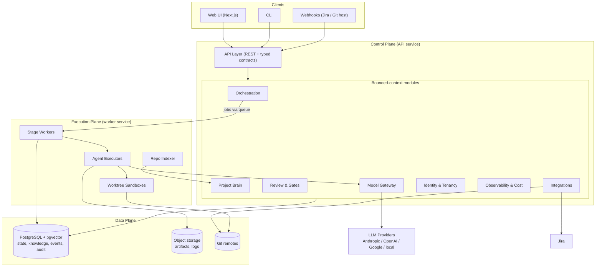
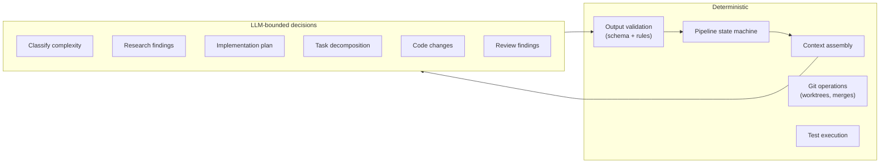

# 01 — High-Level Architecture

## 1. What the system is

An orchestration platform that takes a Jira ticket and drives it through a controlled software development lifecycle: research → planning → (optional human approval) → decomposition → parallel coding → integration → review → testing → iteration → final PR package for human approval.

The defining architectural stance:

> **The system is deterministic. LLMs are components, not the controller.**

Every LLM invocation happens inside a *stage boundary* with typed inputs and typed, validated outputs. The orchestration engine — which stage runs next, when to parallelize, when to pause for a human, when to retry — is ordinary deterministic code operating on persisted state. Given the same state and the same events, the engine always makes the same decision. This is what makes the platform auditable, resumable, and debuggable.

## 2. Architectural style

**Modular monolith in a monorepo**, structured along bounded contexts (see [02-bounded-contexts.md](02-bounded-contexts.md)).

Why not microservices from day one:

- A single developer builds the MVP; a monolith removes an entire class of operational work (service discovery, distributed transactions, versioned APIs between services).
- The scaling pressure in this system is on **workers** (agent execution, indexing), not on the API. Workers scale horizontally out of the same codebase.
- Module boundaries are enforced in-process (each context exposes a typed facade; no reaching into another context's tables). This keeps extraction to services a mechanical refactor, not a rewrite.

The one hard process split that exists from the start: **control plane vs. execution plane** (see §4). Agent execution is untrusted, resource-hungry, and long-running; it never runs inside the API process.

## 3. Layered view

### Control plane (API service)

Stateless HTTP service. Owns all writes to domain state, enforces authorization, evaluates the pipeline state machine, and enqueues jobs. Never calls an LLM directly and never touches a repository checkout.

### Execution plane (worker service)

Same codebase, different entrypoint. Pulls jobs from the queue and runs them:

- **Stage workers** execute one pipeline stage: assemble context, invoke the right agent, validate the output, persist artifacts, report completion.
- **Agent executors** run the actual agent (headless CLI in a git worktree, or an API-driven loop — see [06](06-agent-lifecycle.md)).
- **Repo indexer** builds and refreshes the deterministic repository index for the Project Brain.

Workers are horizontally scalable and individually killable; all state lives in Postgres/object storage, so a dead worker's job is retried elsewhere.

### Data plane

- **PostgreSQL** — the single source of truth: domain state, pipeline state machine, knowledge base (with `pgvector` embeddings), transactional outbox, append-only audit log. See [04](04-database-design.md).
- **Object storage** — large immutable artifacts: diffs, agent transcripts, logs, test reports. Local filesystem in local mode, S3-compatible in cloud mode.
- **Git remotes** — repositories are cloned/fetched into managed workspaces; coding agents work in isolated worktrees.

## 4. The determinism boundary

Rules that hold everywhere:

1. **LLMs never choose control flow.** An agent returns a typed result; the state machine decides what happens next based on that result and the run's policy.
2. **Every LLM output is validated** against a schema before it enters domain state. Invalid output is a retryable failure of the *agent run*, never a corruption of the *pipeline*.
3. **Every LLM call is recorded** (model, parameters, prompt hash, token counts, cost, latency) in the model-call ledger.
4. **Everything an agent saw can be reconstructed.** Context bundles are persisted as artifacts, so any decision can be audited after the fact.
5. **Correction is single-pass.** Review/test failures may create exactly one corrective coding pass. That pass goes directly to deterministic testing without another review; any remaining blocking failure stops the run for manual intervention.

## 5. Request-to-PR flow (condensed)

Full detail in [05-event-flow.md](05-event-flow.md).

1. Webhook or manual action creates a **pipeline run** for a Jira ticket.
2. The engine walks the run through stages; each stage is a queued job executed by a worker.
3. Stages that need judgment invoke an agent through the Model Gateway; stages that don't (git ops, test runs, context assembly) are plain code.
4. Configured **gates** park the run in an awaiting-approval state; the UI/CLI surfaces the pending decision; a human approves, edits, or rejects.
5. Coding tasks fan out to parallel agent executors in isolated worktrees; the integration stage merges branches deterministically.
6. Review and test stages produce findings; blocking findings may spawn one corrective coding pass.
7. The run ends with a **PR package** (branch, description, plan, review report, test evidence) awaiting final human approval.

## 6. Deployment views

### Local (MVP)

Single machine, `docker compose`: Postgres (+pgvector), API process, one worker process, Next.js UI, local filesystem for artifacts and repo workspaces. Agent CLIs installed in the worker image.

### Cloud (later)

Same images, different topology:

- API: N stateless replicas behind a load balancer.
- Workers: autoscaled pool; queue depth drives scale-out. Coding-agent jobs run in per-job sandboxes (container-per-task) for isolation between tenants.
- Postgres: managed (RDS/Cloud SQL) with pgvector; artifacts on S3-compatible storage.
- Repo workspaces: per-worker ephemeral volumes; clones are cache, never truth.

Nothing in the architecture changes between the two — only replica counts and storage backends. Multi-organization tenancy is enforced in the data model from day one (see [04](04-database-design.md)), so cloud multi-tenancy is a deployment decision, not a schema migration.

## 7. Cross-cutting concerns

| Concern | Mechanism |
|---------|-----------|
| **Auditability** | Append-only domain event log + audit log; artifacts immutable and content-hashed; model-call ledger |
| **Observability** | OpenTelemetry traces spanning stage → agent run → model call; structured logs; run timeline built from the event log |
| **Cost control** | Every model call metered in the gateway; budgets per run/project with hard stops |
| **Security** | Agents run with least privilege: scoped file access (worktree only), no repo credentials inside the sandbox (git ops performed by the host executor), secrets never enter prompts |
| **Extensibility** | New agent types = new executor + stage registration; new providers = new gateway adapter; new knowledge kinds = new `KnowledgeItem` kind — no engine changes |
