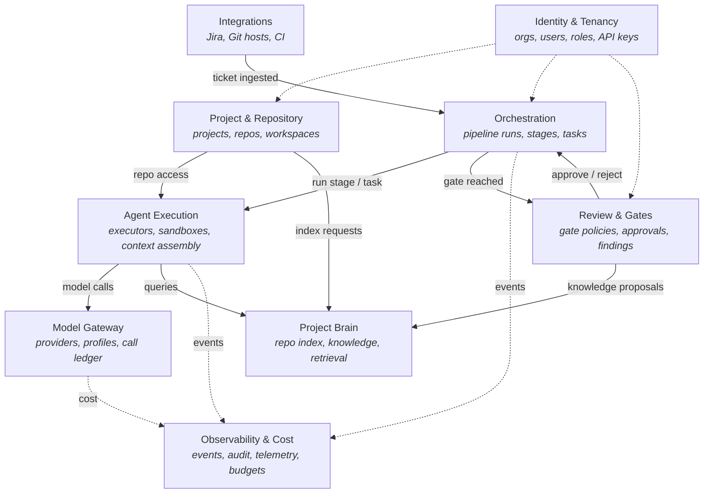

# 02 — Bounded Contexts

The platform is decomposed into nine bounded contexts. Each is a module in the monolith with a **typed facade** (its public API to other contexts), its own tables (no cross-context table access), and its own domain events. Contexts communicate through facades (synchronous, in-process) and domain events (asynchronous, via the outbox).

## 1. Context map



Dotted lines are cross-cutting (tenancy scoping, event/telemetry emission); solid lines are direct collaboration.

## 2. Context responsibilities

### 2.1 Identity & Tenancy

**Owns:** organizations, users, memberships, roles, API keys, sessions.
**Provides:** authentication, authorization checks (`can(user, action, resource)`), tenant scoping. Every other context's data carries an `organization_id`; this context is the authority on what a caller may touch.
**MVP note:** single org, single user — but the schema is multi-tenant from day one.

### 2.2 Project & Repository

**Owns:** projects, repositories, repository credentials, local workspace management (clones, fetch scheduling, worktree allocation/cleanup).
**Provides:** `getRepo`, `allocateWorktree(runId, taskId)`, `releaseWorktree`, branch naming policy, push access.
**Key rule:** repository credentials never leave this context. Agent sandboxes get a checked-out worktree; pushes and fetches are performed by this context on the executor host, not by the agent.

### 2.3 Integrations

**Owns:** external system connectivity — Jira (tickets, comments, transitions), Git hosts (PR creation, PR comments, webhooks), CI status ingestion.
**Provides:** `fetchTicket(key)` returning a normalized `TicketSnapshot`, `createPullRequest(prPackage)`, webhook ingestion endpoints that translate external events into domain commands.
**Anti-corruption layer:** external payloads (Jira JSON, webhook bodies) are translated to internal types at the boundary; no Jira-shaped data flows deeper into the system. External text (ticket bodies, comments) is treated as untrusted input to prompts, never as instructions to the platform.

### 2.4 Orchestration (core)

**Owns:** pipeline runs, stage executions, the task DAG, the pipeline state machine, complexity classification results, the single-correction allowance, and run scheduling.
**Provides:** `startRun(ticket, project, policy)`, `advance(runId, event)` — the single deterministic transition function — plus run queries for the UI (timeline, task graph).
**Key rule:** this context is pure coordination. It never calls an LLM, never touches a file. It decides *what* should happen; Agent Execution decides *how*.

### 2.5 Agent Execution

**Owns:** the `AgentExecutor` registry, sandbox lifecycle (worktrees, later containers), the Context Assembler, agent-run records, output schema validation.
**Provides:** `runAgent(agentKind, taskSpec, contextPolicy) → AgentRunResult`. Consumes Project Brain (retrieval), Model Gateway (LLM calls), Project & Repository (worktrees).
**Key rule:** everything an agent saw is captured as an immutable context-bundle artifact before execution starts.

### 2.6 Model Gateway

**Owns:** provider adapters, model catalog, model profiles (stage/agent → provider+model+params), prompt templates, the model-call ledger, retry/fallback/rate-limit policy.
**Provides:** `complete`, `stream`, `toolLoop`, `embed` — one interface regardless of provider. See [07-model-management.md](07-model-management.md).
**Key rule:** no other context imports a provider SDK. Ever.

### 2.7 Project Brain (Knowledge)

**Owns:** the repository index (symbols, file map, dependency graph), knowledge items (rules, conventions, ADRs, pitfalls, patterns, glossary, business rules), episodic memory (past runs, reviews, tickets), embeddings, the knowledge approval workflow.
**Provides:** `query(projectId, need) → ContextChunk[]` (hybrid structural + semantic retrieval), `propose(knowledgeItem)`, `approve/reject(itemId)`. See [08-project-brain.md](08-project-brain.md).

### 2.8 Review & Gates

**Owns:** gate policies (automation levels), pending approvals, human decisions, review findings and their lifecycle (open → addressed → verified/waived), the final PR-package approval.
**Provides:** `requestGate(runId, gateKind, payload)`, `resolveGate(gateId, decision, comment)`, findings CRUD for the review dashboard.
**Key rule:** a human decision is a domain event with actor, timestamp, and rationale — fully audited, and the only way a parked run moves again.

### 2.9 Observability & Cost

**Owns:** the domain event store (read side), audit log, telemetry aggregation, cost rollups (per call → per agent run → per stage → per run → per project), budget enforcement signals.
**Provides:** run timelines, live log streaming, the cost dashboard, budget-exceeded events that Orchestration treats as a pause condition.

## 3. Relationship patterns

| Relationship | Pattern |
|---|---|
| Integrations → Orchestration | Anti-corruption layer; normalized commands in, nothing external leaks through |
| Orchestration → Agent Execution | Customer/supplier via job queue; Orchestration owns the contract |
| Agent Execution → Model Gateway | Conformist: agents use the gateway interface as-is |
| Agent Execution → Project Brain | Open host service: one query API for all agent types |
| Review & Gates → Orchestration | Events only: gate decisions are events the state machine consumes |
| All → Identity & Tenancy | Shared kernel (tenancy types + auth check), deliberately tiny |
| All → Observability | Published language: every context emits the shared domain-event schema |

## 4. Module layout (monorepo)

```
apps/
  api/          — control-plane entrypoint (mounts context modules)
  worker/       — execution-plane entrypoint (stage workers, executors, indexer)
  web/          — Next.js UI
packages/
  contexts/
    identity/   projects/   integrations/   orchestration/
    agent-execution/   model-gateway/   brain/   gates/   observability/
  domain/       — shared types: IDs, events, artifact kinds (the published language)
  db/           — schema, migrations, query helpers
```

Each context package exports only its facade; lint rules forbid deep imports across contexts. This is the seam along which any context becomes a standalone service later.
