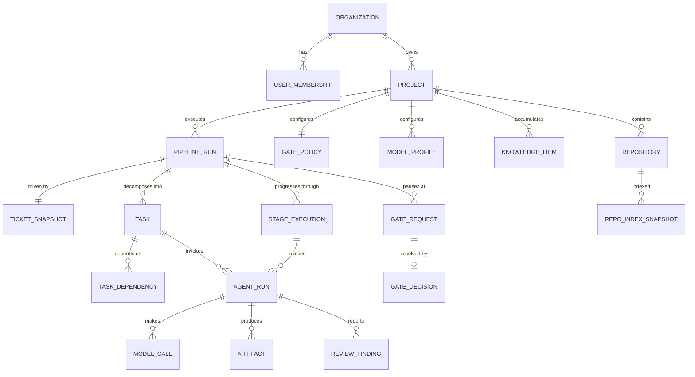

# 03 — Domain Model

Entities, aggregates, invariants, and lifecycle states. The persistence mapping is in [04-database-design.md](04-database-design.md).

## 1. Overview diagram

## 2. Aggregates

Aggregates are consistency boundaries: all invariants inside an aggregate are enforced in one transaction; references across aggregates are by ID only.

### 2.1 Organization (Identity & Tenancy)

Tenant root: users, memberships, roles, API keys. Everything else in the system carries its `organization_id`.

### 2.2 Project (Project & Repository)

- **Project** — groups repositories, holds the gate policy, model profiles, and budgets.
- **Repository** — git remote URL, default branch, credentials reference, index status.

**Invariants:** a repository belongs to exactly one project; branch naming for platform work follows the project policy (`ai/<ticket-key>/<run-short-id>[/task-<n>]`).

### 2.3 PipelineRun (Orchestration) — the central aggregate

One end-to-end execution for one ticket.

| Field | Notes |
|---|---|
| `id`, `project_id`, `repository_id` | identity and scope |
| `ticket_snapshot` | immutable copy of the Jira ticket at intake (key, title, description, acceptance criteria, links) |
| `complexity` | `tiny \| small \| medium \| large \| epic` — set by the classify stage, drives policy |
| `status` | run lifecycle state (see §3.1) |
| `current_stage` | pointer into the stage sequence |
| `policy_snapshot` | frozen copy of gate policy + model profiles at run start |
| `iteration_count` / `iteration_budget` | correction count and frozen allowance; runtime ceiling is one |
| `branch_name` | integration branch for this run |

Child entities (same aggregate):

- **StageExecution** — one attempt at one stage: `stage_kind`, `attempt`, `status`, input/output artifact refs, timing, error.
- **Task** — a decomposed unit of coding work: `title`, `spec_artifact_id`, `status`, `worktree_branch`, `assigned_agent_kind`, `origin` (`decomposition | fix_iteration`), DAG edges via **TaskDependency**.

**Invariants:**

1. `policy_snapshot` is immutable after run start — mid-run config changes never alter a running pipeline (determinism).
2. A stage advances only via the engine's single transition function; there is exactly one non-terminal `current_stage` at a time.
3. A task may start only when all its dependencies are `completed`.
4. `iteration_count <= min(iteration_budget, 1)`; a transition that requests another correction fails the run without emitting more coding work.
5. A run in a gate state accepts no transitions except the corresponding gate decision (or cancellation).

### 2.4 AgentRun (Agent Execution)

One invocation of one agent. `agent_kind` (intake, research, planning, decomposition, coding, integration, review, testing, documentation), `executor_kind` (`cli | api_loop`), link to stage execution or task, `model_profile_used`, `context_bundle_artifact_id`, `status`, telemetry (duration, tokens, cost), `result_artifact_id`, structured `failure_reason`.

**Invariants:** the context bundle artifact is written *before* execution starts; a `succeeded` agent run always has a schema-valid result artifact.

### 2.5 Artifact (shared, owned by Agent Execution)

Immutable, content-hashed output: `kind` (`ticket_snapshot | research_report | implementation_plan | task_spec | context_bundle | diff | review_report | test_report | doc_update | pr_package | agent_transcript`), `content_hash`, `storage_ref` (inline JSONB for small, object storage for large), `produced_by_agent_run_id`, `schema_version`.

**Invariant:** artifacts are never mutated; a revised plan is a new artifact superseding the old (`supersedes_artifact_id`).

### 2.6 GateRequest / GateDecision (Review & Gates)

- **GateRequest** — `run_id`, `gate_kind` (`plan_approval | pre_merge | final_pr | budget_exceeded | iteration_exhausted | knowledge_approval`), payload artifact ref, status (`open | resolved | expired`).
- **GateDecision** — `decided_by` (user), `decision` (`approve | reject | approve_with_edits`), `comment`, optional edited-artifact ref.

**Invariant:** exactly one decision per request; the decision's actor must hold the required role.

### 2.7 ReviewFinding (Review & Gates)

`agent_run_id`, `severity` (`blocker | major | minor | info`), `category` (`requirements | architecture | conventions | security | performance | tests | simplicity | maintainability`), `file`, `line`, `description`, `suggested_fix`, `status` (`open | fix_task_created | addressed | verified | waived`), `waived_by` / `waive_reason`.

**Invariant:** a run cannot reach `final_pr` with open `blocker` findings — they must be `verified` or explicitly `waived` by a human.

### 2.8 KnowledgeItem (Project Brain)

`scope` (`organization | project | repository`), `kind` (`architecture_rule | convention | adr | pitfall | pattern | glossary | business_rule | feature_map`), `origin` (`manual | learned`), `source_run_id` (for learned), `status` (`proposed | approved | deprecated | rejected`), `title`, `content` (markdown), `structured` (JSONB, kind-specific), `version`, `supersedes_id`.

**Invariants:** only `approved` items are served to agents; `learned` items are born `proposed` and require a human `knowledge_approval` gate decision to become `approved`; approving a superseding item deprecates its predecessor atomically.

### 2.9 ModelProfile & ModelCall (Model Gateway)

- **ModelProfile** — `scope` (org/project default or per-run override), `binding` (agent kind or stage kind), `provider`, `model`, `params` (temperature, max tokens, reasoning effort), ordered `fallbacks[]`.
- **ModelCall** — ledger entry: `agent_run_id`, `provider`, `model`, `prompt_hash`, `input_tokens`, `output_tokens`, `cost_usd`, `latency_ms`, `outcome` (`ok | rate_limited | provider_error | invalid_output`), `fallback_index`.

### 2.10 DomainEvent / AuditRecord (Observability)

- **DomainEvent** — append-only: `sequence`, `event_type`, `aggregate_type`, `aggregate_id`, `run_id`, `payload`, `occurred_at`. The run timeline, task graph history, and live log feed are projections of this stream.
- **AuditRecord** — human- and system-initiated actions with `actor_kind` (`user | agent | system`), `actor_id`, `action`, `subject`, `before/after` refs.

## 3. Lifecycle states

### 3.1 PipelineRun status

`created → classifying → researching → planning → awaiting_plan_approval? → decomposing → executing → integrating → reviewing → testing → (iterating ↺ executing) → documenting → packaging → awaiting_final_approval → completed`

Plus cross-cutting terminal/paused states: `failed`, `cancelled`, `paused` (budget/manual), and any `awaiting_*` gate state. The full state machine with guards is in [05-event-flow.md](05-event-flow.md).

### 3.2 Task status

`pending → ready → running → completed | failed`
`failed` tasks retry up to a per-task attempt budget, then fail the stage (which parks the run, not the process).

### 3.3 AgentRun status

`queued → preparing (context assembly) → running → validating → succeeded | failed(reason)`
Failure reasons are typed: `invalid_output`, `sandbox_error`, `model_error`, `timeout`, `budget_denied` — the engine's retry policy branches on them deterministically.

## 4. Complexity → policy mapping

Complexity classification is an LLM decision (bounded, validated); its *consequences* are a deterministic lookup:

| Complexity | Tasks | Parallel coding agents | Default gates | Iteration budget |
|---|---|---|---|---|
| tiny | 1 | 1 | final PR only | 1 |
| small | 1–2 | 1 | final PR | 2 |
| medium | 2–5 | up to 3 | plan + final PR | 3 |
| large | 5–12 | up to 5 | plan + pre-merge + final PR | 4 |
| epic | reject → split | — | human must split ticket | — |

Values are project-configurable; the table is the shipped default. An `epic` classification never silently proceeds — it parks the run and asks a human to split the ticket in Jira.
