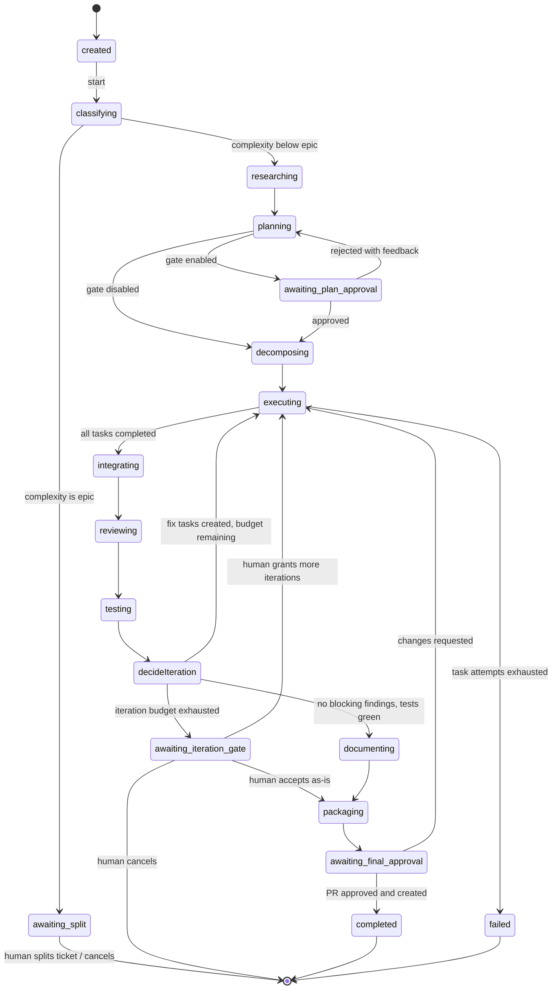

# 05 — Event Flow & Orchestration

## 1. The engine in one paragraph

A pipeline run is a persisted finite state machine. The engine exposes a single pure-ish transition function — `advance(runState, event) → (newState, commands)` — invoked inside a transaction whenever an event arrives (stage finished, gate decided, task completed, budget exceeded). It compares the event against the current state and the run's frozen `policy_snapshot`, writes the new state, appends domain events, and enqueues commands (jobs) via the outbox. No LLM, no wall-clock nondeterminism, no hidden inputs: state + event → next state, every time.

## 2. Pipeline state machine



Cross-cutting (omitted from the diagram for legibility): any active state can move to `paused` (budget exceeded, manual pause) and back; any non-terminal state can move to `cancelled`. Which `awaiting_*` gates exist for a given run is decided **once**, at run start, from the project's automation level + complexity (see [03 §4](03-domain-model.md)) and frozen into `policy_snapshot`.

### Automation levels → enabled gates

| Level | plan approval | pre-merge | final PR |
|---|---|---|---|
| `research_only` | run stops after planning; nothing executes | — | — |
| `plan_gated` | ✔ | — | ✔ |
| `code_gated` | ✔ | ✔ | ✔ |
| `review_gated` | — | ✔ | ✔ |
| `autonomous` | — | — | ✔ |

The final PR gate can never be disabled — the human is always the final decision maker.

## 3. Event catalog

Events are the published language (`packages/domain`). Naming: `<aggregate>.<past-tense-fact>`.

| Event | Emitted by | Consumed by |
|---|---|---|
| `run.created` | Integrations / UI | Orchestration (starts machine) |
| `run.stage.started` / `run.stage.completed` / `run.stage.failed` | Workers | Orchestration, Observability |
| `run.complexity.classified` | Classify stage | Orchestration (policy lookup) |
| `run.gate.requested` | Orchestration | Gates (creates approval item), UI notification |
| `run.gate.resolved` | Gates | Orchestration (resume machine) |
| `task.created` / `task.ready` / `task.started` / `task.completed` / `task.failed` | Orchestration / workers | Orchestration (DAG progress), Observability |
| `agent_run.started` / `agent_run.completed` / `agent_run.failed` | Agent Execution | Observability, Orchestration (via stage/task) |
| `artifact.created` | Agent Execution | Observability |
| `review.finding.reported` / `review.finding.resolved` | Review stage / Gates | Orchestration (iteration decision), UI |
| `model.call.completed` | Model Gateway | Observability & Cost |
| `budget.threshold.crossed` / `budget.exhausted` | Observability & Cost | Orchestration (pause) |
| `knowledge.proposed` / `knowledge.approved` / `knowledge.rejected` | Brain / Gates | Brain (index refresh), Observability |
| `pr.package.ready` / `pr.created` | Packaging stage / Integrations | Gates, Observability |

## 4. Happy-path sequence (medium ticket, plan-gated)

```mermaid
sequenceDiagram
    participant J as Jira
    participant O as Orchestrator
    participant W as Worker
    participant B as Project Brain
    participant G as Model Gateway
    participant H as Human
    participant GH as Git Host

    J->>O: webhook: ticket ready (run.created)
    O->>W: job: classify
    W->>G: classify complexity (bounded LLM call)
    W-->>O: run.complexity.classified (medium)
    O->>W: job: research
    W->>B: query(architecture, related features, conventions)
    W->>G: research agent
    W-->>O: research_report artifact, stage completed
    O->>W: job: plan
    W->>G: planning agent (ticket + research + rules)
    W-->>O: implementation_plan artifact
    O->>H: run.gate.requested (plan approval)
    H-->>O: approve (with edits)
    O->>W: job: decompose
    W->>G: decomposition agent → task DAG
    W-->>O: tasks created (T1, T2, T3; T3 depends on T1)
    par parallel coding
        O->>W: job: task T1 (worktree wt-1)
        O->>W: job: task T2 (worktree wt-2)
    end
    W-->>O: T1, T2 completed → T3 ready
    O->>W: job: task T3
    W-->>O: T3 completed
    O->>W: job: integrate (merge task branches → run branch)
    O->>W: job: review
    W->>G: review agent → findings (1 major)
    O->>O: iteration 1: create fix task from finding
    O->>W: job: fix task → integrate → review → test
    W-->>O: tests green, no blocking findings
    O->>W: job: document, then package
    W-->>O: pr_package artifact
    O->>H: run.gate.requested (final PR approval)
    H-->>O: approve
    O->>GH: create pull request
    O-->>J: comment + transition ticket
```

## 5. The iteration loop, precisely

After `testing`, the engine evaluates — deterministically:

1. Collect open `blocker`/`major` findings and failing tests.
2. If none → `documenting`.
3. Else, if `iteration_count < iteration_budget`:
   - increment `iteration_count`;
   - ask the planning agent to turn findings/failures into **fix task specs** (bounded LLM step, validated output);
   - create tasks with `origin = fix_iteration`, link each finding to its fix task (`fix_task_created`);
   - re-enter `executing` with only the new tasks.
4. Else → `awaiting_iteration_gate`: a human decides — grant more iterations, accept as-is (waiving remaining findings explicitly), or cancel.

Findings are the unit of iteration accounting: a finding that survives two fix attempts is flagged in the gate payload so the human sees *what the system could not fix*, not just that it failed.

## 6. Failure semantics

| Failure | Deterministic response |
|---|---|
| Agent run `invalid_output` | Retry same agent with validation errors appended (max 2), then fail the stage |
| Editing agent `timeout` / `model_error` / `rate_limited` / `sandbox_error` | Continue through the configured model targets, then the alternate authenticated Codex/Claude CLI in the same worktree; if all are exhausted, the stage fails |
| Task fails after `max_attempts` | Stage `executing` fails → run `failed` with full diagnostics (never silent partial merge) |
| Worker dies mid-job | pg-boss redelivers; handlers are idempotent on `(id, attempt)`; a fresh worktree is cut for redelivered coding tasks |
| Budget exhausted | Run → `paused` + gate request; human tops up or cancels |
| Gate rejected | Engine routes per gate kind: plan rejection → back to `planning` with the reviewer's feedback as input; final-PR rejection → new fix iteration |
| Merge conflict in `integrating` | Integration agent attempts resolution in a scratch worktree; unresolvable conflicts fail the stage → gate, never auto-forced |

## 7. Why this is deterministic

- The transition table is code, versioned with the repo; `policy_snapshot` freezes configuration per run.
- All inputs to `advance` are persisted (state row + event payload) — any historical transition can be replayed and asserted in tests.
- LLM nondeterminism is contained inside stages: it changes artifact *content*, never the *shape* of the run. Two runs of the same ticket may produce different plans, but they traverse the same machine under the same policy.
- Concurrency is serialized per run via the version CAS (see [04 §3](04-database-design.md)); parallelism exists only where the machine explicitly fans out (task DAG), and fan-in is an explicit guarded transition (`all tasks completed`).
