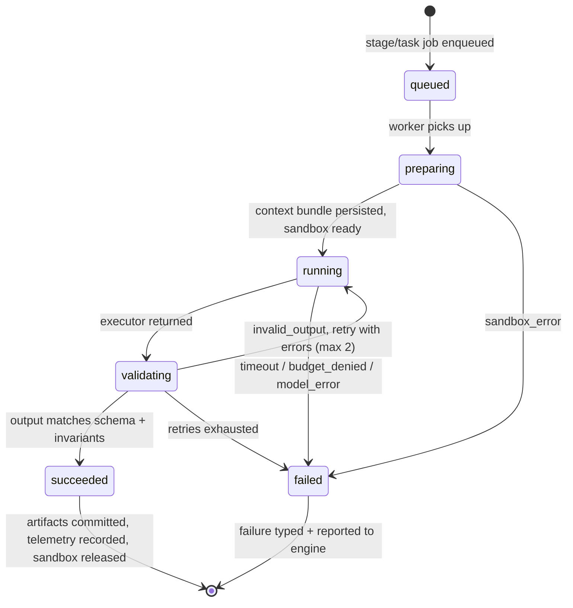

# 06 — Agent Lifecycle

## 1. The agent contract

Every agent — intake, research, planning, decomposition, coding, integration, review, testing, documentation — satisfies one contract:

```ts
interface AgentDefinition<I, O> {
  kind: AgentKind;
  inputSchema: ZodSchema<I>; // what the agent receives
  outputSchema: ZodSchema<O>; // what it must return — validated before anything persists
  contextPolicy: ContextPolicy; // what the Context Assembler gathers (see §3)
  promptTemplate: PromptTemplateRef; // versioned, editable in the UI
}

interface AgentExecutor {
  executorKind: 'cli' | 'scripted' | 'api_loop';
  supports(kind: AgentKind): boolean;
  execute(input: AgentExecutionInput): Promise<AgentExecutionResult>;
}

interface AgentExecutionInput {
  agentRunId: string;
  definition: AgentDefinition<unknown, unknown>;
  contextBundle: ContextBundle; // persisted as an artifact BEFORE execution
  modelProfile: ResolvedModelProfile;
  sandbox?: SandboxHandle; // present only for agents that touch files
  limits: { timeoutMs: number; maxCostUsd: number; maxToolCalls?: number };
}

interface AgentExecutionResult {
  status: 'succeeded' | 'failed';
  failureReason?: 'invalid_output' | 'sandbox_error' | 'model_error' | 'timeout' | 'budget_denied';
  output?: unknown; // schema-validated by the harness, not trusted from the executor
  artifacts: ArtifactDraft[]; // transcript, diff, reports
  telemetry: { durationMs: number; inputTokens: number; outputTokens: number; costUsd: number };
}
```

Two executor implementations of the same contract:

- **`cli` (MVP):** runs a headless agent CLI (e.g. Claude Code non-interactive mode) inside the sandbox. The harness writes the context bundle into the sandbox as files + a generated prompt, invokes the CLI with tool permissions scoped to the worktree, captures the transcript, and reads results from the working tree / a required output file.
- **`api_loop` (later):** an in-process tool-use loop against the Model Gateway with platform-owned tools (read file, edit file, run command, query Brain). Full control over context and determinism boundaries; more work to build.

The registry maps `agent kind → preferred executor` per project, so executors can be swapped per agent type without touching the engine.

## 2. Lifecycle



**preparing** — the Context Assembler builds the `ContextBundle` (§3) and persists it as an immutable artifact; for file-touching agents, Project & Repository allocates a git worktree on a fresh branch. Nothing runs until what-the-agent-will-see is durably recorded.

**running** — the executor runs under hard limits: wall-clock timeout, cost ceiling (enforced by the Model Gateway per `agentRunId`), and tool-call budget. All model traffic flows through the gateway and lands in the call ledger.

**validating** — the harness (never the executor) parses and validates output against `outputSchema`, then applies agent-specific invariants — e.g. a coding result's diff must stay inside the task's declared file scope (violations outside it fail validation with an explanation); a review result's findings must carry severity + category; a decomposition's task DAG must be acyclic with resolvable dependencies. On `invalid_output`, the agent is re-invoked with the validation errors appended — twice, then fail.

**teardown** — worktrees are always released (task branch pushed to the platform's namespace first if the run succeeded); transcripts are stored as artifacts; the agent-run row gets final telemetry.

## 3. Context assembly — what agents see

**Coding agents never receive the full repository.** The Context Assembler deterministically builds each bundle from the agent's `ContextPolicy`:

```ts
interface ContextBundle {
  taskSpec: TaskSpec; // or stage input for non-coding agents
  ticket: TicketSnapshot;
  plan?: PlanExcerpt; // only sections relevant to this task
  repoContext: {
    fileMap: FileMapExcerpt; // directory shape around the touched area
    files: FileContent[]; // explicitly selected relevant files
    symbols: SymbolRef[]; // signatures of neighboring code, not bodies
  };
  knowledge: {
    rules: KnowledgeItem[]; // approved architecture rules + conventions in scope
    decisions: KnowledgeItem[]; // relevant ADRs
    pitfalls: KnowledgeItem[];
    patterns: KnowledgeItem[]; // reusable implementation patterns
  };
  priorAttempts?: AttemptSummary[]; // for fix iterations: what was tried, what failed
  constraints: TaskConstraints; // file scope, forbidden paths, test commands
}
```

Selection is layered (detail in [08-project-brain.md](08-project-brain.md)):

1. **Structural (deterministic):** files named in the task spec, their import neighbors from the dependency graph, associated tests, configs in scope.
2. **Curated (deterministic):** all approved rules/conventions matching the task's scope tags — rules are never "retrieved", they are always included.
3. **Semantic (ranked):** vector search over patterns, past implementations, pitfalls — top-k, budget-capped.
4. **Budgeting:** the bundle is trimmed to the model profile's context budget in fixed priority order (spec > rules > primary files > plan excerpt > neighbors > semantic extras) — so what gets dropped under pressure is predictable, and recorded in the bundle artifact.

## 4. Sandboxing

| Aspect            | MVP (worktrees)                                                                                                              | Cloud (containers)                           |
| ----------------- | ---------------------------------------------------------------------------------------------------------------------------- | -------------------------------------------- |
| Isolation unit    | git worktree per task, branch `ai/<ticket>/<run>/task-<n>`                                                                   | container per task with the worktree mounted |
| File scope        | CLI tool permissions restricted to the worktree path                                                                         | filesystem namespace = worktree only         |
| Network           | agent has no direct network; model traffic via gateway; `cli` executor's provider access is the one exception, scoped by env | egress allowlist (provider endpoints only)   |
| Credentials       | none in sandbox — git push/fetch done by Project & Repository on the host                                                    | same, via sidecar                            |
| Command execution | allowlisted commands (build, test, lint) declared per repository                                                             | same, enforced by container profile          |
| Cleanup           | worktree pruned on release, always                                                                                           | container destroyed                          |

Integration is deterministic git, not an LLM merge: the integration stage octopus-merges task branches into the run branch in dependency order; only on conflict does the integration _agent_ get involved, in a scratch worktree, and its resolution goes through review like any other change.

## 4b. File-touching agents: which CLI runs the work

Coding and merge-conflict resolution are **pluggable per purpose and project**, because stages can
benefit from different agents and cost/effort settings. Three executors ship:

| Executor      | What it is                                                                                                    | When to use it                                        |
| ------------- | ------------------------------------------------------------------------------------------------------------- | ----------------------------------------------------- |
| `claude_code` | Claude Code CLI, non-interactive (`-p --output-format json --permission-mode acceptEdits`), prompt over stdin | default; strongest coding agent available today       |
| `codex`       | OpenAI Codex CLI (`codex exec --full-auto`), prompt over stdin                                                | teams standardized on Codex                           |
| `api_loop`    | the platform's own tool loop through the Model Gateway                                                        | no CLI dependency; full control over tools and limits |
| `scripted`    | deterministic stand-in                                                                                        | tests and offline demos                               |

Selection is project model profile → organization model profile → legacy
`repositories.settings.executor` → `CODING_EXECUTOR` env → `claude_code`. A `claude_cli` profile
maps to `claude_code`; `codex_cli` maps to `codex`. Profile `model` and `reasoningEffort` are passed
to the CLI. `executorBinary` and `executorArgs` remain escape hatches for a pinned or custom CLI.

**Invocation rules, common to every CLI preset:**

- The binary is spawned **directly, never through a shell**, so prompt text can
  never be interpreted as shell syntax.
- The prompt goes over **stdin**, so its size is bounded only by the CLI, and
  it is also written to `.ai-system-prompt.md` in the worktree so a human can
  see exactly what ran.
- The subprocess gets `PATH`, `HOME`, and only the variables the preset's
  `envAllowlist` names. Repository credentials are never among them.
- CLIs report their own spend. That usage is written into `model_calls` under
  provider `cli:<name>`, so budgets and cost dashboards count CLI-driven work
  the same as gateway calls — otherwise every cost view would silently
  under-report.
- A CLI that exits non-zero is a `sandbox_error`; a CLI that runs cleanly but
  reports its own failure (`is_error: true`) is a `model_error`. The engine's
  retry decision depends on that distinction.

Availability is probed at worker startup and via `ai-system repo check-agents`,
so a missing binary is reported before a run needs it rather than as an opaque
task failure.

## 5. Parallelism

Task-DAG fan-out is the only parallelism. The engine marks tasks `ready` when dependencies complete; workers pull ready tasks up to the complexity policy's parallelism cap (see [03 §4](03-domain-model.md)). Decomposition is instructed to produce tasks with **disjoint file scopes** wherever possible; validation warns on overlap, and overlapping tasks get an explicit dependency edge instead of running concurrently — conflicts are prevented by scheduling, not resolved by merging heroics.

## 6. Agent roster (initial)

| Agent                 | Executor (MVP)                  | Input → Output                                                          | Notes                                                                                                                                                    |
| --------------------- | ------------------------------- | ----------------------------------------------------------------------- | -------------------------------------------------------------------------------------------------------------------------------------------------------- |
| Intake                | api_loop-style single call      | ticket snapshot → normalized requirements + open questions              | flags unanswerable tickets for humans                                                                                                                    |
| Complexity classifier | single call                     | requirements + repo stats → complexity + rationale                      | part of intake stage                                                                                                                                     |
| Research              | cli or single call              | requirements → research report (relevant code, related features, risks) | read-only sandbox                                                                                                                                        |
| Planning              | single call                     | requirements + research + rules → implementation plan                   | plan is the gate artifact                                                                                                                                |
| Decomposition         | single call                     | plan → task DAG with specs + file scopes                                | validated: acyclic, scoped                                                                                                                               |
| Coding                | **cli**                         | task spec + bundle → diff on task branch                                | the workhorse                                                                                                                                            |
| Integration           | deterministic + cli on conflict | task branches → run branch                                              | git first, agent second                                                                                                                                  |
| Review                | cli (read-only)                 | run diff + plan + rules → findings                                      | explains, never rewrites                                                                                                                                 |
| Specialized review    | cli (read-only)                 | run diff → findings in one dimension                                    | opt-in per repository: `security`, `performance`, `migration`; each pass is blind to the other dimensions, and attribution rides in the finding category |
| Testing               | deterministic + single call     | run branch → test report (+ suggested fixes on failure)                 | tests run as plain commands; the LLM only interprets                                                                                                     |
| Documentation         | cli                             | diff + plan → docs/changelog updates                                    | own task branch, reviewed like code                                                                                                                      |

Adding an agent type = a definition (schemas, context policy, prompt template) + executor support + stage or task registration. The engine does not change.

**Specialized reviewers** are the cheapest version of that rule: the specialty list is data (`ReviewSpecialty` in the domain package), and adding one is a new entry plus a system prompt. A repository opts in with `repo register --reviewers security,migration`; a repository that opts into nothing pays for nothing. Each pass is deliberately narrow — a reviewer that reports everything reports nothing in particular, and category-based attribution stops meaning anything.
