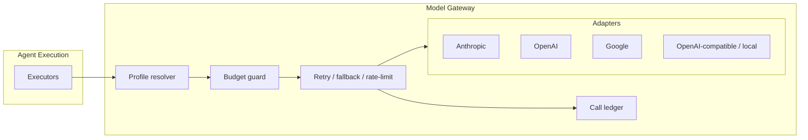

# 07 — Model Management & Provider Abstraction

## 1. Goals

- Any stage can use any provider's model; mixing providers within one run is normal (e.g. plan with one vendor's strongest reasoning model, code with another's, review with a third).
- No provider SDK appears outside the Model Gateway context.
- Every call is metered, priced, and attributable to agent run → task/stage → run → project → org.
- Failures degrade predictably: retries → fallback chain → typed error to the engine.

## 2. The gateway interface

```ts
interface ModelGateway {
  complete(req: CompletionRequest, meta: CallMeta): Promise<CompletionResult>;
  stream(req: CompletionRequest, meta: CallMeta): AsyncIterable<CompletionDelta>;
  toolLoop(req: ToolLoopRequest, meta: CallMeta): Promise<ToolLoopResult>; // for api_loop executors
  embed(req: EmbedRequest, meta: CallMeta): Promise<EmbedResult>;
}

interface CompletionRequest {
  profile: ResolvedModelProfile;      // provider+model+params already resolved
  system: string;
  messages: Message[];
  responseSchema?: JsonSchema;        // structured output — enforced per provider capability
}

interface CallMeta {                  // attribution + control, mandatory on every call
  organizationId: string; runId: string; agentRunId: string;
  purpose: string;                    // 'planning' | 'coding' | ...
  budget: { remainingUsd: number };   // gateway refuses calls that would exceed it → budget_denied
}
```

Provider adapters implement a smaller internal SPI (`invoke`, `countTokens`, `price`, capability flags: structured output, tool use, reasoning-effort, streaming). The gateway normalizes differences: providers without native structured output get schema-in-prompt + gateway-side JSON validation and repair-retry; token accounting uses provider usage data when returned, adapter estimation otherwise.



The `cli` executor is the one component that talks to a provider without going through the gateway's request path (the CLI owns its own loop). It is still integrated: the gateway issues it a scoped budget, and the executor reports the CLI's token/cost telemetry into the same ledger after the run, tagged `via: 'cli'`.

## 3. Model profiles & resolution

A **ModelProfile** binds `agent kind (or stage)` → `{provider, model, params, fallbacks[]}`. Resolution is a deterministic cascade, most specific wins:

```
run policy_snapshot override  >  project profile  >  organization default  >  platform default
```

Resolution happens **once per run at start** and is frozen into `policy_snapshot` — changing a project's profiles never alters an in-flight run. Example project configuration:

```yaml
profiles:
  planning:    { provider: anthropic, model: claude-fable-5, params: { reasoning: high } }
  coding:      { provider: anthropic, model: claude-sonnet-5,
                 fallbacks: [{ provider: openai, model: gpt-5.2-codex }] }
  review:      { provider: openai,    model: gpt-5.2, params: { temperature: 0 } }
  research:    { provider: google,    model: gemini-3-pro }
  classifier:  { provider: anthropic, model: claude-haiku-4-5 }
  embeddings:  { provider: voyage,    model: voyage-3-large }
```

(Models above are illustrative; the model catalog — context windows, pricing, capability flags — is data, updated without code changes.)

## 4. Reliability policy

Per call, in order:

1. **Rate limit** — per-provider concurrency + token-rate caps; queued, not dropped.
2. **Retry** — transient errors (5xx, timeouts, rate-limit responses) retried with exponential backoff + jitter, bounded per profile (default 3).
3. **Fallback** — on retry exhaustion, advance down the profile's `fallbacks[]` chain; `fallback_index` is recorded on the ledger row so degraded runs are visible.
4. **Fail typed** — chain exhausted → `model_error` to the agent harness; the engine decides (retry stage later, fail stage, park run). The gateway never invents an answer.

Structured-output failures are handled *above* fallback: schema-invalid output triggers one in-place repair attempt (validation errors appended), then counts as a failed attempt.

## 5. Cost metering & budgets

- Every ledger row carries `input_tokens`, `output_tokens`, `cost_usd` (priced from the model catalog at call time — historical prices stay historical).
- Budgets are hierarchical: per agent run (limit in `AgentExecutionInput`), per pipeline run, per project per month. The gateway checks *before* dispatching; a would-exceed call returns `budget_denied` and emits `budget.exhausted`, which the engine turns into a paused run + human gate — a run never dies mid-flight for cost reasons without a human seeing it.
- The cost dashboard is SQL over the ledger: by project, by run, by stage, by provider, by model, over time. "What did this ticket cost, and where?" is one query.

## 6. Prompt management

- Prompt templates are versioned entities (`prompt_templates`: binding, version, body, changelog), editable in the UI; each agent definition references a template binding, resolved at run start and frozen like model profiles.
- Rendered prompts are not stored verbatim per call (bundles already are); the ledger stores a `prompt_hash` so identical-input calls are identifiable and template versions are provably linked to outcomes.
- Template changes are auditable events; A/B-ing a template = two versions + comparing run outcomes in the dashboard. No silent prompt drift.

## 7. Adding a provider

1. Implement the adapter SPI (one file: auth, request mapping, usage extraction, error mapping).
2. Add catalog entries (models, prices, capabilities).
3. Done — profiles can now reference it. No engine, agent, or UI changes.
