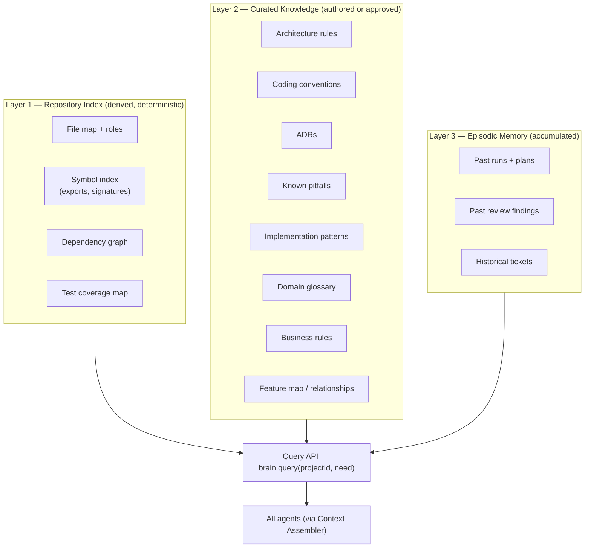
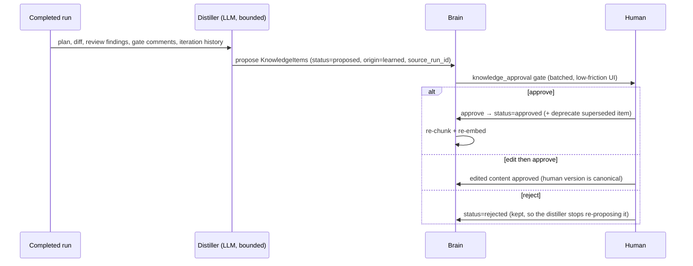

# 08 — Project Brain

The Project Brain is the platform's long-term memory: everything the "AI engineering team" knows about a project beyond the ticket in front of it. It is what turns a generic coding agent into *your* engineer — one that knows the architecture, respects the conventions, remembers past decisions, and avoids known pitfalls.

## 1. Three layers



### Layer 1 — Repository index (derived truth)

Rebuilt deterministically from the repo by the indexer (tree-sitter based):

- **File map:** tree with role classification (source / test / config / docs / generated) and size stats.
- **Symbol index:** exported symbols, signatures, doc comments — enables "show signatures of neighbors, not bodies" context.
- **Dependency graph:** import edges between files/modules — powers structural context selection and blast-radius estimates.
- **Test coverage map:** which tests exercise which files (from coverage reports when available, path convention otherwise).

Indexing runs on repo registration, then incrementally on default-branch changes (webhook-triggered); staleness is tracked per commit (`repo_index_snapshots`). This layer is **cache, never truth** — always rebuildable, never hand-edited.

### Layer 2 — Curated knowledge (governed truth)

`KnowledgeItem` rows (schema in [04 §2.6](04-database-design.md)): markdown content + kind-specific structured fields, versioned, scoped to org / project / repository. Two origins:

- **`manual` (static knowledge):** authored by humans in the UI, or imported (existing ADR folders, CONTRIBUTING.md, lint configs). Rarely changes.
- **`learned`:** proposed by the platform (see §3). Never active without human approval.

Kind-specific structure matters for enforcement, not just retrieval — e.g. an `architecture_rule` carries `applies_to` path globs and a machine-checkable predicate where possible (import restrictions, layering constraints), so the review stage can check some rules deterministically and reserve LLM judgment for the rest.

### Layer 3 — Episodic memory (experience)

Automatically accumulated, no approval needed because it is *record*, not *rule*: completed runs with their plans and outcomes, review findings and how they were resolved, ticket history. Used for "have we done something like this before?" retrieval and as the raw material learning distills from.

## 2. Query API

One facade for every agent, used by the Context Assembler (agents don't freelance their own retrieval):

```ts
interface BrainQuery {
  projectId: string;
  need: {
    structural?: { files?: string[]; nearFiles?: string[]; symbols?: string[] };
    rules?: { scopeTags: string[] };            // returns ALL matching approved rules
    semantic?: { query: string; kinds: SourceType[]; topK: number };
    episodic?: { similarTo: string; topK: number }; // past runs/reviews/tickets
  };
  budget: { maxTokens: number };
}
```

Retrieval strategy — **structural first, semantic second**:

1. **Structural lookup** (deterministic): exact answers from Layer 1 — the files, their neighbors, their tests.
2. **Rule inclusion** (deterministic): approved rules/conventions matching the scope are *always* included, never rank-filtered. Correctness constraints must not depend on embedding luck.
3. **Semantic search** (ranked): pgvector cosine over `knowledge_chunks` for patterns, pitfalls, ADRs, and episodic memory; hybrid-scored with keyword match; top-k under the token budget.
4. Results carry provenance (`source_type`, `source_id`) so every statement in an agent's context is traceable to a knowledge item, file, or past run.

## 3. Learning loop — how knowledge grows



**Distillation triggers:** run completion (what patterns emerged, what the reviewer kept flagging, what a human said when rejecting a plan), and repeated-finding detection (the same review finding category on the same module across N runs strongly suggests a missing convention).

**Guard rails:**

- Proposals must cite evidence (run IDs, findings) — uncited proposals are auto-rejected by validation.
- Proposals are deduplicated against existing items (semantic similarity) and framed as *supersede* when they conflict with an approved item — conflict is surfaced to the human, never silently resolved.
- The approval gate batches proposals per run and renders a diff-style view (new rule vs. existing related rules) so approval takes seconds, not archaeology. Approving knowledge must be cheap or it will not happen.
- Rejected items persist as negative examples for the distiller.

## 4. Retrieval tuning from outcomes

The Brain's value proposition is that better context produces better first drafts. That claim is testable, so the platform tests it.

**Grants.** Every assembled context writes one `context_grants` row per source the run received — approved rules, semantic hits, episodes — recording the section it landed in and the retrieval score at the time. One row per run per source: the grant means "this run saw this", not how often.

**Outcomes.** A run is *settled* once it reaches the final gate or stops for good; it is a *first-pass success* when it settles without failing and consumes no iteration. Joining grants to settled runs gives, per source: how many runs received it, how many of those needed no iteration, and the average iteration count. Evaluation replays are excluded, exactly as they are from analytics.

**The prior.** Sources measurably above the project's baseline first-pass rate earn a small positive ranking adjustment; those below earn a negative one. Three constraints keep this from becoming superstition:

- **Sample floor.** Fewer than three settled runs earns nothing. One lucky run must not pin a rule to the top of every future context window.
- **Bounded.** The adjustment is clamped to ±0.05 on a cosine scale — a tiebreak, not a re-ranking. It cannot overturn a real similarity gap.
- **Applied after search, never to rules.** The prior reorders what nearest-neighbour retrieval already returned; it can never introduce material similarity rejected. Approved rules are unaffected: they are always included in full regardless of how the runs that received them fared.

**It is correlation, and every surface says so.** Material is retrieved because it looks relevant, and the hardest tickets attract the most of it, so a genuinely good rule can show a below-baseline rate simply by being granted where the work is hard. The analytics view, the CLI (`ai-system brain effectiveness`), and the API response all label it as correlation and show the sample size. A number that would be misread is worse than no number.

## 5. Static vs. learned — the operational distinction

| | Static knowledge | Learned knowledge |
|---|---|---|
| Examples | architecture, folder structure, standards, naming, design patterns | new ADRs, review lessons, better patterns, discovered pitfalls |
| Origin | `manual` (authored/imported) | `learned` (distilled from runs) |
| Change rate | rare, deliberate | continuous, proposed |
| Activation | immediately `approved` on authoring (author is the human) | `proposed` until a human approves |
| Versioning | new version supersedes old | same mechanism — one lifecycle for all knowledge |

One storage model, one approval mechanic, one retrieval path — the distinction is governance metadata, not infrastructure.

## 6. Bootstrapping a new project

Day-one value without months of accumulation:

1. Register repo → indexer builds Layer 1 automatically.
2. **Import scan:** the platform proposes knowledge from what exists — ADR folders, CONTRIBUTING/README, lint and formatter configs (conventions), CODEOWNERS (ownership hints) — as `proposed` items for one-shot human review.
3. **Interview mode (optional):** a guided session where the platform asks targeted questions ("three layers or four?", "where do integration tests live?") and drafts rules from the answers.
4. From then on, the learning loop compounds.

## 7. UI surface

- **Knowledge base browser:** filter by kind/scope/status; full version history; provenance links to source runs.
- **Approval inbox:** pending proposals with evidence and conflict diffs.
- **Rule editor:** markdown + structured fields, with preview of which files/paths a rule applies to.
- **Brain inspector (debugging):** given a task spec, show exactly what the Context Assembler would select and why — the single most valuable tool for tuning retrieval.
